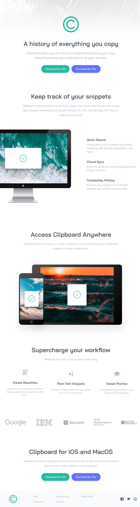
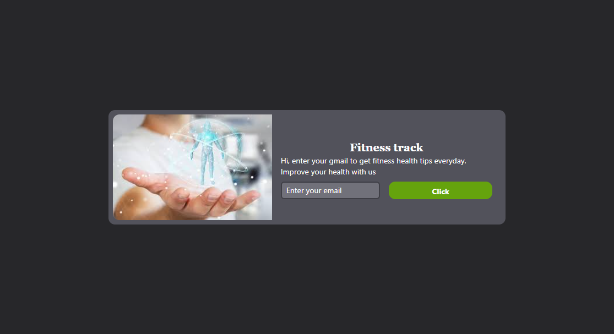

# ⚡ React Tailwind UI Snippets  

A collection of **ready-to-use React + Tailwind CSS UI components** to start your projects. Whether you need a **login page**, **product card**, **pricing grid**, or a **gallery layout**, these snippets are built to be **clean, responsive, and easy to customize**.  

---

## ✨ Features  

🎨 **Pre-Built UI Templates**  
- Login & Register forms  
- Product cards & modal previews  
- Pricing grids & feature lists  
- Image gallery & responsive layouts  

⚡ **Plug-and-Play**  
- Copy → Paste → Run. That’s it.  

📱 **Responsive by Default**  
- Mobile-first with Tailwind breakpoints  

🔧 **Easily Customizable**  
- Change colors, spacing, and typography with Tailwind classes  

---

## 📸 Screenshots  

  
   &emsp;  
   &emsp;  
    

  

---

## 🚀 Getting Started  

Clone this repo and start exploring the snippets.  

### 📋 Prerequisites  
- Node.js (LTS recommended)  
- npm or yarn  

## 🛠️ Tech Stack

- React – Component-based UI library

- Tailwind CSS – Utility-first CSS framework

## 🔮 Future Additions

- Dashboard templates

- Navbar + Sidebar layouts

- Advanced form components

- Dark mode variants

## 🙋 Author

**Santhosh Kumar P S**

📧 Email: santhoshkumarsakthi2003@gmail.com

💻 GitHub: SanthoshKumar-PS

---
